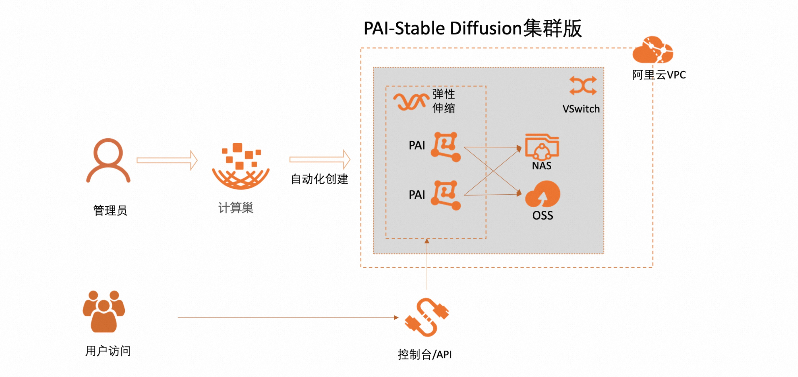
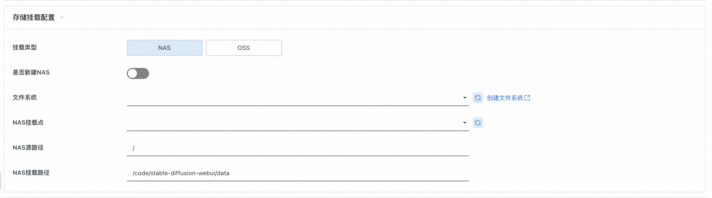
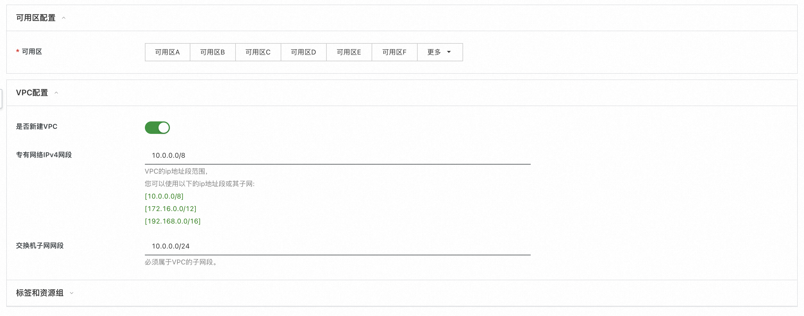
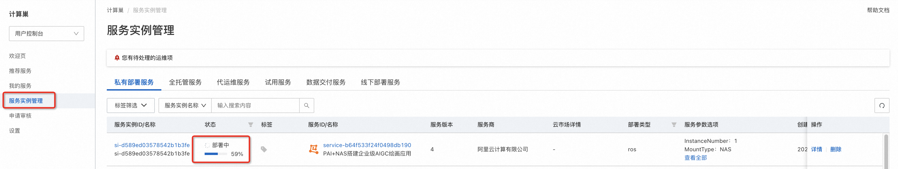
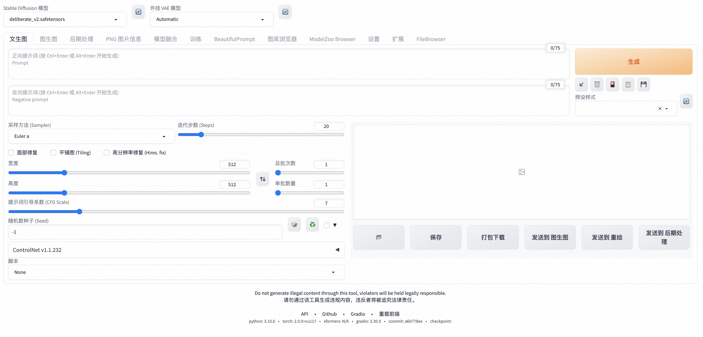

# quickstart-pai-stable-diffusion

## 背景说明
阿里云计算巢提供了Stable Diffusion快速部署及下载自定义模型功能，使用者不需要自己下载代码，不需要自己安装复杂的依赖，不需要了解Git、Python、Docker等技术，只需要在控制台图形界面点击几下鼠标就可以快速启动Stable Diffusion服务进行绘画，非技术同学也能轻松搞定。
前文[Stable Diffusion集群版--计算巢私有化部署方案](http://t.csdn.cn/0B7tO)介绍了如何在计算巢基于ECS快速创建Stable Diffusion，本文基于阿里云机器学习平台（PAI）快速部署Stable Diffusion，底层可自由选择NAS或OSS存储生成的图片。
## 架构说明
- 通过计算巢一键创建服务和应用，简化vpc/vswitch/pai/nas/oss创建过程，通过编排控制资源的拉起顺序，完成资源和软件一键部署；
- Stable Diffusion可选择单机版、集群版，提供公网URL给到用户访问；
- 部署前可自由选择挂载NAS、OSS，同时支持选择新建/已有挂载设备，方便用户自由选择存储产品；
- 部署前可自由选择填入已有/新建VPC；
  

## 方案实践
1. 登录[阿里云计算巢控制台](https://computenest.console.aliyun.com/user/cn-hangzhou/serviceInstanceCreate?ServiceId=service-b64f533f24f0498db190)，进入 PAI+NAS搭建企业级AIGC绘画应用 服务实例创建页面，填写相关参数，填写完成点击确认订单(确保账号有余额)。
   
   存储挂载配置，可选择使用NAS或OSS，两者二选其一，其中每种存储可以选择是否新建。
   若选择NAS且选择新建，则无需填写其他参数，默认即可：
   
   若选择NAS且选择不新建，则需要选择文件系统与挂载点：
   
   若选择OSS且选择新建，则无需填写其他参数，默认即可：
   
   若选择OSS且选择不新建，则需要填写OSS的文件路径：
   
   选择可用区、VPC、交换机等内容，若需新建则走默认即可：
   
#### 参数说明

| 参数组        | 参数项         | 示例                                 | 说明                                                                                                          |
|------------|-------------|------------------------------------|-------------------------------------------------------------------------------------------------------------|
| 服务实例名称     | N/A         | test                               | 实例的名称                                                                                                       |
| 地域         | N/A         | 华东1（杭州）                            | 选中服务实例的地域，建议就近选中，以获取更好的网络延时。                                                                                |
| PAI配置	| 类型	| 标准版	                               | 可选标准版、集群版|
|PAI配置	|运行命令| 	./webei ……	                       |标准版与集群版命令不同，默认即可|
|PAI配置	|实例数| 	1	                                |实例数量|
|PAI配置	|资源组种类	| 公共资源组	                             |可选公共资源组与自定义的资源组|
|PAI配置	|实例规格	| ml.gu7i.c16m60.1-gu30              |		资源组种类为公共资源组时选择|
|PAI配置	|CPU	| 1	                                 |资源组种类为非公共资源组时选择|
|PAI配置|	Memory| 	30000                             |	资源组种类为非公共资源组时选择|
|PAI配置|	GPU	| 8	                                 |资源组种类为非公共资源组时选择|
|存储挂载配置	|挂载类型| 	NAS                               |	选择NAS或OSS|
|存储挂载配置|	是否新建NAS| 	是                                 |	选择NAS时选择|
|存储挂载配置|	NAS源路径| 	/                                 |	选择NAS时选择|
|存储挂载配置|	NAS挂载路径| 	/code/stable-diffusion-webui/data |	选择NAS时选择|
|存储挂载配置|	文件系统| 	xxx                               |	选择NAS且不新建NAS时选择|
|存储挂载配置|	NAS挂载点| 	xxx                               |	选择NAS且不新建NAS时选择|
|存储挂载配置|	是否新建OSS| 	是                                 |	选择OSS时选择|
|存储挂载配置|	OSS挂载路径| 	/code/stable-diffusion-webui/data |	选择OSS时选择|
|存储挂载配置|	文件路径| 	xxx                               |	选择OSS且不新建OSS时选择|
| 可用区配置      | 可用区         | 可用区I                               | 不同地域可用区不同                              |
| VPC设置      | 是否新建VPC     | 是                                  | 若是，计算巢将自动创建VPC和Vswitch，若否，则需要填入已经创建好的VPC和Vswitch                              |
| VPC设置 | 专有网络VPC实例ID | vpc-xxx                            | 按实际情况，选择专有网络的ID。                                                                                            |
| VPC设置 | 交换机实例ID     | vsw-xxx                            | 按实际情况，选择交换机ID。若找不到交换机, 可尝试切换地域和可用区。                                                                         |
2. 确认参数后，勾选我已阅读并同意《计算巢服务协议》，点击"立即创建"按钮，本示例以新建NAS与VPC为例：
   
   
3. 查看部署进度。 点击列表页查看，可以看到刚刚创建的服务实例以及服务部署进度。
   
4. 访问stable-diffusion 等待状态变为"已部署"后，点击详情，进入对应的服务实例后，可以在页面上点击以访问。
   
   进入服务实例详情页：
   
   点击Endpoint，即可进入下方页面，开始绘画！
   
## 其他功能
模型下载/插件下载/RDS相关功能 参考单机版功能相同不重复复制了[如何在阿里云快速启动Stable Diffusion轻松玩转AI绘画_AIGC_实战派_阿里云帮助中心](https://help.aliyun.com/practice_detail/611227#d8e1e0e0c4jaj)。
## 总结
本文介绍了通过PAI创建绘画应用Stable Diffusion的详细功能实践，计算巢在私有化部署(cloud op）场景下提供一键部署、高效运维、弹性伸缩等功能，提供详细的报价信息、资源分组、分账展示等功能，方便客户在解决方案类场景下快速部署落地。

